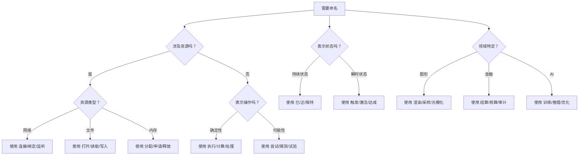
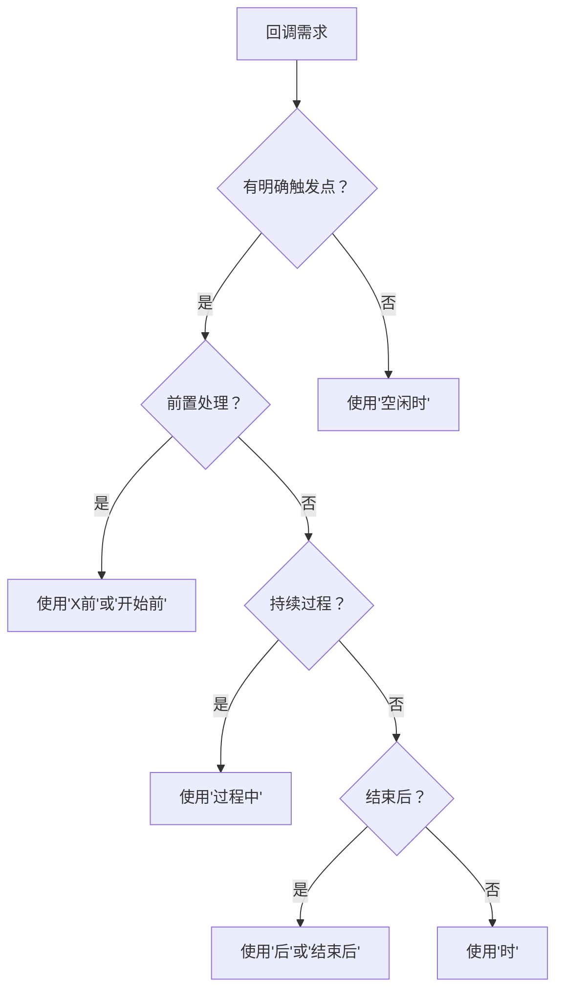

# 中文代码规范（V5.0）

---

## **核心原则**

1. **语义精确化**  
   - 通过量词、状态词缀和领域术语消除歧义，实现"代码即注释"
   - 布尔值强制使用"是否/是否已/是否正"前缀，状态显式化
   - 禁用模糊量词（如"一些"、"若干"），使用精确单位
   - 同义词选择：遵循场景驱动和语义精确原则，通过不同词语传达细微差异

2. **适配性**  
   - 中文语法（动宾结构、成语隐喻）及本土技术术语  
   - 中文量词体系（如"个/项/帧/批/份"），适配垂直领域（金融用"笔"，医疗用"例"）
   - 使用行业特定成语（如金融领域"多头空头"，医疗领域"望闻问切"）

3. **严谨性**  
   - 保留英文技术关键词（如JSON/HTTP）  
   - 类型标记（变量名体现数据类型，如"列表""映射"）
   - 同义词选择应承载额外信息量（如"重连"→标准，"立即重连"→时效性）

4. **可扩展性**  
   - 允许团队定制量词与术语，兼容国际化需求（中英对照表）  
   - 支持渐进式重构，新旧代码共存时标记`规范待重构`
   - 提供自动化迁移工具接口规范

---

## **同义词精细化选择规范**

> 每个同义词选择都应承载额外信息量  
> 示例：  
> `重连()` → 标准操作  
> `立即重连()` → 强调时效性  
> `尝试重连()` → 暗示可能失败  
> `计划重连()` → 延迟执行

### 1. 同义词选择框架

#### 1.1 生命周期强度梯度
| 强度 | 创建类             | 销毁类             | 适用场景                  |
|------|-------------------|-------------------|--------------------------|
| 强   | 创建/初始化/构建   | 销毁/终结/清除     | 重量级资源（数据库连接） |
| 中   | 打开/启动/建立     | 关闭/停止/断开     | 可复用资源（文件句柄）   |
| 弱   | 准备/生成/分配     | 释放/回收/清理     | 临时对象（内存块）       |

#### 1.2 操作确定性梯度
| 确定性 | 动词选择            | 示例                      |
|--------|---------------------|--------------------------|
| 确定   | 执行/计算/处理       | `执行计算()`              |
| 可能   | 尝试/试验/探测       | `尝试连接()`              |
| 推测   | 估计/预测/推断       | `预测结果()`              |
| 失败容错| 恢复/重试/回退       | `恢复会话()`              |

#### 1.3 状态变化维度
| 变化类型 | 状态开启     | 状态关闭      | 适用场景   |
|----------|--------------|---------------|-----------|
| 开关状态 | 启用/激活/开启 | 禁用/停用/关闭 | 功能开关   |
| 存在状态 | 存在/就绪/在线 | 缺失/离线/未就绪 | 资源可用性 |
| 过程状态 | 进行中/执行中  | 已完成/已终止   | 任务生命周期 |
| 条件状态 | 满足/符合/达成 | 违反/超出/未满足 | 条件判断   |

### 2. 领域专用同义词库

#### 2.1 网络通信领域
```cpp
void 建立连接();    // TCP三次握手
void 绑定端口();    // 服务器端操作
void 监听请求();    // 持续接收
void 发送数据包();  // 离散数据单元
void 传输流();      // 连续数据流
```

#### 2.2 数据处理领域
```cpp
void 转换格式();    // 数据结构不变
void 重构数据();    // 改变数据结构
void 过滤记录();    // 移除部分数据
void 清洗数据集();   // 全面质量控制
void 归并结果();     // 多数据集合并
```

#### 2.3 用户界面领域
```cpp
void 呈现界面();    // 整体显示
void 刷新控件();    // 局部更新
void 展示通知();    // 短暂显示
void 弹出对话框();   // 交互式显示
void 渲染效果();     // 图形绘制
```

#### 2.4 金融领域
```cpp
void 计算利息();    // 常规计算
void 核算成本();    // 全面审查
void 结算交易();    // 最终完成
void 估算风险();    // 预测性计算
void 审计账目();     // 正式核查
```

### 3. 同义词冲突解决策略

#### 3.1 动词精细化选择
| 基础动词 | 精确化场景         | 优选同义词   |
|----------|-------------------|------------|
| 获取     | 网络请求          | 获取 → 拉取 |
|          | 主动轮询          | 获取 → 抓取 |
|          | 被动接收          | 获取 → 接收 |
| 更新     | 全量替换          | 更新 → 重写 |
|          | 增量修改          | 更新 → 修补 |
|          | 状态刷新          | 更新 → 刷新 |

#### 3.2 状态词精细化选择
```cpp
// 连接状态
bool 已连接;    // 物理链路建立
bool 已认证;    // 身份验证完成
bool 已激活;    // 业务功能可用

// 任务状态
bool 已提交;    // 任务进入系统
bool 已分配;    // 资源已分配
bool 执行中;    // 正在处理
bool 已归档;    // 完成且存储
```

#### 3.3 名词精细化选择
```cpp
// 数据处理
数据快照    // 静态时间点数据
数据流      // 连续动态数据
数据摘要    // 精简表示

// 错误处理
警告        // 可继续执行
异常        // 需要处理
致命错误    // 无法恢复
```

### 4. 同义词组合规则

#### 4.1 动词+宾语组合规范
| 动词   | 适用宾语范围       | 禁止组合          | 替代方案   |
|--------|------------------|------------------|-----------|
| 解析   | 数据/协议/语法    | 解析用户 → 分析用户 | 分析/理解 |
| 压缩   | 数据/文件/内存    | 压缩时间 → 缩短时间 | 优化/减少 |
| 验证   | 数据/身份/签名    | 验证理论 → 检验理论 | 检验/证明 |

#### 4.2 状态词+主体组合规范
```cpp
// 正确组合
bool 证书有效;     // 状态+客体
bool 服务可用;     // 服务+状态
bool 用户已认证;   // 主体+状态

// 错误组合
bool 有效证书;     // 应改为"证书有效"
bool 可用性状态;   // 冗余，应为"服务可用"
```

### 5. 同义词决策流程图



---

## **命名规范体系**

### 1. 结构化命名模板  
`[作用域][主体][量词/状态][业务描述]`  
**优化规则**：  
- 类内部可省略重复作用域（如`订单处理器`类内使用`待支付数量`而非`订单待支付数量`）  
- 作用域层级不超过两级（如`系统网络状态`简化为`网络状态`）
- 全局唯一资源添加`全局`前缀（如`全局用户表锁`）

#### 1.1 上下文依赖命名模式

**模式**:在类或模块内部，依赖上下文可以省略作用域，此时采用以下三种模式之一。

-  1. 动作操作型 → 现代汉语动宾结构 `[动作][主体][量词]`
	- 用于**主动操作**，执行动作
	- 函数名直接体现动作目标（如释放火球技能次），动词前置强化意图
	- 量词用于显式声明操作粒度，批/次/件等

-  2. 状态描述型 → 文言倒装式 `[状态][主体][量词]`
	- 用于**状态描述，日志记录**，记录状态结果
	- 变量名`已击败敌人个`通过倒装突出结果（已击败）和主体（敌人）
	- 日志命名`冲突加载次`快速传达事件类型和频次
	- 量词用于显示结果计量

-  3. 属性从属型 → 所属结构 `[主体]之[属性][描述]`
	- 用于**表示属性从属关系**，定义对象属性
	- 通过`之`连接主体与属性（如`血量之最大值`），明确表示“血量的最大值”，避免歧义。
	- 适用于**类属性/配置项/状态同步**等需要明确所属关系的场景。
	- 量词用于显示属性单位，秒/分/时

-  4. **混合使用**：
	- 在任务系统中，`提交任务项`（现代汉语动宾结构）对应主动行为，`已提交任务项`（文言倒装式）记录结果，形成完整语义链。
	- 通过`异常任务项`等命名实现日志内容的自我解释。
	- 在类设计中，使用所属结构（如`任务之目标剩余`）表示任务目标的剩余数量，清晰表达属性归属。

#### 1.2 示例

```cpp
// 现代汉语动宾结构
// 场景：角色技能系统
class 角色技能管理器 {
public:
    // 动作+主体+量词：批量释放火球技能
    void 释放火球技能次(int 数量) {
        for (int 计数器 = 0; 计数器 < 数量; 计数器++) {
            生成火球效果();
        }
    }

    // 动作+主体+量词：单次触发无敌状态
    void 触发无敌状态次() {
        if (!是否已无敌) {
            设置无敌状态(true);
        }
    }

private:
    bool 是否已无敌 = false;
};

// 场景：背包物品管理
void 添加装备件(字符串 装备名) {
    玩家背包列表.pushback(装备名);
    日志系统.记录("已添加装备件"); // 文言倒装式的日志命名
}

// 文言倒装式
// 场景：战斗统计系统
class 战斗统计器 {
public:
    // 描述+主体+量词：已击败敌人个数
    int 已击败敌人个 = 0;

    // 描述+主体+量词：待拾取战利品项数
    int 待拾取战利品项 = 0;

    void 检查成就条件() {
        if (已击败敌人个 > 100) {
            触发成就("百人斩");
        }
    }
};

// 场景：场景加载监控
void 加载地图张(字符串 地图名) {
    if (是否正加载) {
         日志系统.记录("冲突加载次"); // 文言倒装式的异常日志
        return;
    }
    已加载地图张++;
    开始异步加载(地图名);
}


// 混合示例 现代汉语动宾结构 文言倒装式
// 场景：任务系统
class 任务处理器 {
public:
    // 动宾结构方法命名
    void 提交任务项(任务 新任务) {
        if (是否任务可提交(新任务)) {
            已提交任务项++; // 文言倒装式：倒装式变量命名
            待处理任务列表.pushback(新任务);
        }
    }

    // 倒装式日志记录
    void 记录异常任务项() {
        日志系统.记录("异常任务项=" + 异常任务计数器);
    }

private:
    int 已提交任务项 = 0;
    vector<任务> 待处理任务列表;
};

// 场景：任务系统（所属结构 + 现代汉语动宾结构）
class 任务追踪器 {
public:
    // 所属结构：配置项命名
    int 任务之目标剩余 = 3;          // 剩余任务目标数
    
    // 现代汉语动宾结构：动宾结构方法命名
    void 完成任务目标个() {
        任务之目标剩余--;
        日志.记录("已完成任务目标个"); // 文言倒装式日志
    }
};
// 场景：角色属性管理
class 游戏角色 {
private:
    // 使用"之"明确所属关系
    int 血量之最大值 = 1000;        // 角色的最大生命值
    int 魔法之当前值 = 500;         // 当前魔法值
    float 移速之基础 = 6.0f;     // 基础移动速度

public:
    // 状态类属性命名
    bool 状态之是否无敌 = false;    // 是否处于无敌状态
    string 装备之武器名称 = "青铜剑"; // 当前装备的武器名称

    void 更新状态次() {
        if (血量之最大值 < 当前血量) {
            当前血量 = 血量之最大值;  // 确保血量不超过上限
        }
    }
};

// 场景：背包物品配置项
struct 背包配置 {
    // 物品容量限制
    int 药品之容量最大 = 99;          // 最大可携带药品数量
    int 武器之槽位已解锁 = 4;         // 已解锁的武器槽位数
    
    // 特殊物品状态
    bool 钥匙之是否持有 = true;       // 是否持有任务钥匙
    string 任务道具之名称当前 = "古老地图"; // 当前任务道具名称
};

// 场景：技能系统
class 火球术技能 {
private:
    // 技能参数命名
    float 伤害之基础值 = 150.0f;       // 基础伤害值
    int 冷却之剩余秒 = 0;         // 剩余冷却时间（秒）

public:
    void 释放技能次() {
        if (冷却之剩余秒 <= 0) {
            触发火焰特效();
            冷却之剩余秒 = 10;    // 重置冷却时间
        }
    }
};


// 遵循：
// 1. 类属性 → 所属结构（主体之属性）
// 2. 状态变量 → 文言倒装式（状态主体量词）
// 3. 方法 → 动宾结构（动作主体量词）
// 4. 实例 → 带"实例"后缀
// 5. 量词 → 显式声明单位（帧/毫秒/批）

// 类名使用名词，采用驼峰式
class 角色控制器 {
private:
    // 所属结构：属性命名（主体之属性）
	float 移速之基础值 = 5.0f;   // 明确"基础速度"是移动速度的属性
    float 移速之当前值 = 5.0f;   // "当前速度"从属于移动速度
    // 状态变量用文言倒装式
    int 已持续跳跃毫秒 = 0;    // ✔️ [状态][主体][量词] // 倒装结构强调持续时间
    float 帧时间毫秒 = 0.1f;         // ✔️ 带单位的量词
        
public:
    // 布尔类型强制"是否"前缀（状态显式化）
    bool 是否着地 = false;      // ✔️ 明确状态类型
    bool 是否正跳跃 = false;     // ✔️ "正"表示进行中状态  
    // 方法使用动宾结构（动词在前）
    void 执行跳跃次()
	  {         // ✔️ [动作][主体][量词]
        if (是否着地 && !是否正跳跃)
          {
            是否正跳跃 = true;
            施加力值(...);
		  }
	  }
	// 文言倒装式状态更新
    void 更新状态帧() {          // 动词+主体+量词（帧级更新）
        是否着地 = 检测地面碰撞();
        if (是否正跳跃) {
            已持续跳跃毫秒 += 帧时间毫秒;
        }
    }
}

// 实例命名添加"实例"后缀
角色控制器 玩家角色实例;

// 使用示例
void 游戏循环() {
    while (是否游戏运行中) {
        玩家角色实例.更新状态帧();        
        if (输入系统.是否已按下(按键空格)) { 玩家角色实例.执行跳跃次(); }        
        渲染系统.提交帧批();
    }
}


```

### 2. 数据类型映射  
| 数据类型      | 命名模式                | 示例                     | 使用场景说明  |
| --------- | ------------------- | ---------------------- | ------- |
| **布尔值**   | 是否/是否已/是否正/可否/能否    | `是否在线`, `是否已提交`      | 状态标志位   |
| **列表/数组** | ...列表/...数组/...集    | `商品列表`, `坐标数组`       | 同类型元素集合 |
| **字典/映射** | ...映射/...字典/...表    | `城市坐标映射`, `用户配置表`    | 键值对数据结构 |
| **计数器**   | ...计数器/...计数        | `请求次数计数器`, `帧计数`     | 数值累加场景  |
| **回调函数**  | ...时/...前/...后/...中 | `碰撞时`, `销毁前`           | 事件驱动编程  |
| **枚举类型**  | ...枚举/...类型         | `状态枚举`, `颜色类型`       | 有限选项集合  |
| **时间类型**  | ...时间/...时刻/...时长   | `创建时间`, `响应时长`       | 时间相关操作  |
| **指针类型**  | ...指针/...引用         | `纹理指针`, `数据引用`       | 资源引用和共享 |
| **流对象**   | ...流/...管道          | `数据流`, `日志管道`        | 数据流处理   |
| **线程对象**  | ...线程/...任务         | `渲染线程`, `计算任务`       | 并发编程    |
| **锁对象**   | ...锁/...互斥体         | `资源锁`, `队列互斥体`       | 线程同步    |
| **文件对象**  | ...文件/...资源标识标识     | `配置文件`, `日志资源标识`       | 文件操作    |
| **网络连接**  | ...连接/...对接口        | `客户端连接`, `TCP对接口`    | 网络通信    |
| **矩阵/向量** | ...矩阵/...向量         | `变换矩阵`, `位置向量`       | 数学计算    |
| **配置对象**  | ...配置/...设置         | `系统配置`, `用户设置`       | 参数管理    |
| **可选值**   | 可选...              | `可选用户名`, `可选令牌`      | 可能为空的值  |
| **错误对象**  | ...错误/...异常         | `网络错误`, `格式异常`       | 错误处理    |
| **迭代器**   | ...迭代器/...游标        | `列表迭代器`, `数据库游标`     | 集合遍历    |
| **缓冲区**   | ...缓冲/...缓存         | `帧缓冲`, `磁盘缓存`        | 临时数据存储  |
| **树结构**   | ...树/...节点          | `场景树`, `二叉树节点`       | 层级数据结构  |
| **图结构**   | ...图/...边/...点      | `社交图`, `关系边`, `用户点` | 关系型数据结构 |

### 3. 量词与状态系统  

#### 3.1 量词表（通用+领域扩展）

| 量词      | 适用场景    | 示例        | 精度说明   |
| ------- | ------- | --------- | ------ |
| **个**   | 通用可数单位  | 用户个数     | 基础计数单位 |
| **批**   | 批量操作    | 日志批次     | 无固定大小  |
| **笔**   | 金融交易    | 交易笔数     | 单次交易单位 |
| **例**   | 医疗/异常事件 | 异常病例     | 单个病例   |
| **帧**   | 图形处理    | 渲染帧率     | 单帧画面   |
| **毫秒**  | 高精度计时   | 响应延迟毫秒  | 时间单位   |
| **兆字节** | 内存管理    | 分配内存兆字节 | 内存单位   |
| **纳秒**  | 高性能计算   | 执行时长纳秒  | 极小时序单位 |
| **像素**  | 图形界面    | 偏移像素     | 屏幕坐标单位 |
| **分贝**  | 音频处理    | 噪声级别分贝  | 声音强度单位 |

#### 3.2 状态词缀  

| 词缀     | 含义   | 示例   | 新增说明   |
| ------ | ---- | ---- | ------ |
| **已** | 完成态  | 已提交 | 基础完成态  |
| **未** | 未完成态 | 未审核 | 基础未完成态 |
| **正** | 进行中  | 正上传 | 新增进行时态 |
| **禁** | 操作限制 | 禁删除 | 权限限制状态 |
| **异** | 异常状态 | 异中断 | 异常情况   |
| **临** | 临界状态 | 临超载 | 新增预警状态 |
| **待** | 等待状态 | 待审批 | 新增等待状态 |
| **需** | 需求状态 | 需维护 | 新增需求标记 |

### 4. 回调函数的时机词缀表
| 词缀      | 含义             | 示例               | 触发频率 |
| ------- | -------------- | ---------------- | ---- |
| **时**   | 事件发生时立即触发      | `碰撞时玩家扣血`      |      |
| **前**   | 事件发生前预处理       | `保存前文档校验格式`    |      |
| **后**   | 事件完成后处理        | `下载后文件解密`      |      |
| **开始前** | 事件启动前的准备工作     | `渲染开始前场景预加载资源` |      |
| **开始时** | 事件启动时的初始化操作    | `播放开始时视频记录时间戳` |      |
| **过程中** | 事件进行中的持续处理     | `上传过程中文件更新进度`  |      |
| **中断时** | 事件被意外中断时的处理    | `下载中断时任务保存状态`  |      |
| **恢复时** | 中断后恢复时的处理      | `播放恢复时音频淡入效果`  |      |
| **结束时** | 事件自然结束时的处理     | `动画结束时角色切换状态`  |      |
| **超时后** | 超时发生后的处理       | `响应超时后请求重试操作`  |      |
| **失败时** | 操作失败时的错误处理     | `验证失败时用户提示错误`  |      |
| **成功时** | 操作成功时的后续处理     | `登录成功时系统跳转主页`  |      |
| **每帧时** | 游戏/动画每帧调用的高频处理 | `每帧时物理更新碰撞`    |      |
| **空闲时** | 系统空闲时的后台处理     | `空闲时内存清理缓存`    |      |
| **临界时** | 达到临界条件时的特殊处理   | `温度临界时设备启动风扇`  |      |
| **切换时** | 状态/场景切换时的过渡处理  | `场景切换时游戏卸载资源`  |      |
|         |                |                  |      |



#### 时机词缀使用场景详解

#### 4.1高频事件处理（游戏/动画）
```cpp
// 每帧物理更新
void 每帧时物理更新碰撞() {
    for (auto& 物体 : 物理世界.物体列表) {
        物体.更新位置();
    }
}

// 每帧渲染处理
void 每帧时渲染提交批次() {
    已渲染帧数++;
    显卡.提交(当前帧缓冲);
}
```

#### 4.2 异步任务处理
```cpp
// 上传过程进度更新
void 上传过程中文件更新进度(int 已传字节, int 总字节) {
    float 进度 = staticcast<float>(已传字节) / 总字节;
    界面.更新进度条(进度);
}

// 任务中断恢复
void 恢复时下载继续传输() {
    if (已下载字节 > 0) {
        网络.恢复下载(已下载字节);
    }
}
```

#### 4.3 状态变更处理
```cpp
// 温度监控
void 临界时CPU降频() {
    if (温度 > 90.0f) {
        CPU.设置频率(基础频率 * 0.7f);
        已触发降频次++;
    }
}

// 用户认证
void 失败时登录锁定账户() {
    错误计数++;
    if (错误计数 >= 3) {
        账户.锁定();
        已锁定账户个++;
    }
}
```

#### 4.4 资源管理
```cpp
// 场景切换资源处理
void 切换时场景卸载资源(场景 旧场景) {
    资源管理器.卸载(旧场景.资源列表);
    已释放内存MB += 旧场景.内存占用;
}

// 空闲时内存优化
void 空闲时系统压缩内存() {
    if (可用内存 < 阈值) {
        内存.压缩();
        已压缩内存次++;
    }
}
```

#### 4.5 复合时机处理
```cpp
// 带状态检查的复合时机
void 超时后请求处理异常() {
    if (!已收到响应) {
        取消请求个++;
        抛出异常("超时网络请求项");
    }
}

// 带条件判断的临界处理
void 临界时电池切换模式() {
    if (电量 < 10) {
        激活节能模式次++;
        系统.切换模式(模式::节能);
    } else if (温度 > 45) {
        激活安全模式次++;
        系统.切换模式(模式::安全);
    }
}
```

#### 4.6 使用规范说明

1. **复合词缀原则**：
   - 简单事件：单词缀（时/前/后）
   - 复杂事件：复合词缀（开始前/超时后）
   - 最长不超过3个汉字（如"过程中"）

2. **词缀选择优先级**：
   ```mermaid
   graph TD
   A[需要预处理？] -->|是| B[使用'前'或'开始前']
   A -->|否| C{事件有持续过程？}
   C -->|是| D[使用'过程中']
   C -->|否| E{事件结束后？}
   E -->|是| F[使用'后'或'结束后']
   E -->|否| G[使用'时']
   ```

3. **特殊场景处理**：
   - 高频事件：优先使用"每帧时"
   - 错误处理：使用"失败时"或"超时后"
   - 状态监控：使用"临界时"

扩展时机词缀覆盖软件开发中多数的回调场景，通过精准描述触发时机，可提高代码的可读性和维护性。

---

### 5. 枚举类型设计规范

#### 5.1 枚举类型设计需遵循：
1. **状态显式化**：使用`已/未/正`等状态词缀
2. **量词体系**：包含垂直领域量词（笔/例/帧）
3. **所属结构**：复杂枚举采用`主体状态类型`格式
4. **命名结构**：
    - 状态描述：`[业务领域]状态`（文言倒装）
    - 属性分类：`[主体]之[属性]`（所属结构）


> **规范要点**：
> - 简单状态：直接使用状态词（`未开始/已暂停`）。
> - 复合状态：采用`主体状态`结构（`连接异常中断`）。
> - 布尔状态：包含`是否`前缀。
 
#### 5.2 示例

##### 基础状态枚举
```cpp
// 文言倒装式：通用状态描述
enum 任务状态 {
    未开始,      // 基础状态
    执行中,      // 进行态
    已暂停,      // 状态词缀
    已完成,      // 完成态
    已失败       // 异常态
};

// 所属结构：设备属性
enum 网络设备之类型 {
  路由器,
  交换机,
  防火墙,
  接入点
};

// 正确量词应用
enum 日志级别 {
  调试条,
  信息条,
  警告项,
  错误例
};

```

##### 带量词的领域枚举
```cpp

// 医疗领域 - 文言倒装式
enum 患者检测结果 {
  未检出,
  阳性,
  弱阳性,
  阴性
};

// 金融领域 - 所属结构
enum 交易之状态 {
  已提交,
  处理中,
  已完成,
  已拒绝
};

```

##### 复合状态枚举（所属结构）
```cpp
// 网络连接状态（主体状态类型）
enum 网络连接状态 {
    连接未初始化,   // [主体][状态]
    连接认证中,
    连接已加密,
    连接异常中断
};

// 文件操作权限（主体属性类型）
enum 文件访问权限 {
    文件可读,      // [主体][属性]
    文件可写,
    文件可执行,
    文件禁删除     // 操作限制
};
```

##### 带前缀的布尔枚举
```cpp
//系统监控状态（强制"是否"前缀）
Enum 系统警报状态{
    是否CPU过载 = 1
    是否内存泄漏 = 2
    是否网络阻塞 = 3
    是否磁盘已满 = 4 // 状态词缀+量词
}
```

##### 最佳实践建议
1. **状态流转**：按生命周期顺序声明枚举值
```cpp
// 订单状态生命周期
enum 订单流程状态 {
    未支付,       // → 
    支付中,       // → 
    已发货,       // → 
    已签收,       // 终态
    已取消        // 异常终态
};
```

2. **领域扩展**：添加垂直领域后缀
```cpp
// 电力系统专属状态
enum 电网故障类型 {
    短路异常,     // 基础异常
    过载异常,
    接地故障,     // 电力领域术语
    谐波超标      // 专业状态
};
```


### 6.  命名缩写规范

#### 6.1 可逆性原则  
- **核心要求**：缩写必须可无歧义还原为原词。  
- **实施规则**：  
  - 在代码注释或文档中，**首次出现缩写时需标注完整原词**（例：`// DB（Database）`）。  
  - **禁止缩写以下成分**：  
    - 量词/状态词缀（如：个、已、正）；  
    - 领域核心术语（如：帧、笔、例、表）。  

#### 6.2 最小语义单元截取  
- **优先级**：  
  - 优先截取**核心语素**（例："数据库" → `库`，而非`数`）；  
  - 保留**关键特征字**（例："身份证" → 不缩写，"增值税专用发票" → `增值税票`）。  
- **复合词处理**：按语义分块截取（例："网络连接池" → `网联池`）。  

#### 6.3 领域共识优先  
- **层级顺序**：  
  1. 采用**行业既定缩写**（例：金融领域 "上证指数" → `沪指`）；  
  2. 继承**团队历史习惯**（例："员工编号" → `工号`）。  

#### 6.4 长度控制策略  
- **缩写触发条件**： 
	-  ≥4字尝试缩写（“固定资产折旧计算器”→“固资折旧计算器”）
	- 在类作用域内允许二次压缩（外部用“用户”，类内部可省略） 
	- ≤3字不用缩写（“用户名”保持全称）

---

## **实践示例**

### 场景：数据库操作
```cpp
// 连接管理（生命周期强度梯度应用）
void 创建连接池();       // 强生命周期创建
void 建立数据库连接();    // 中强度连接
void 分配查询句柄();      // 弱资源分配

// 事务处理（操作确定性梯度）
void 开启事务();         // 确定性操作
void 尝试提交变更();      // 可能失败操作
void 回滚操作();         // 失败容错操作

// 数据操作（同义词组合规则）
void 插入记录();         // 动词+宾语规范
void 批量导入数据();      // 量词应用
```

### 场景：网络通信
```cpp
// 连接阶段（领域同义词应用）
void 初始化套接字();      // 基础准备
void 绑定端口();         // 服务端操作
void 连接服务器();        // 客户端操作

// 状态管理（状态词精细化）
bool 连接已建立;          // 物理层
bool 会话已激活;          // 应用层
bool 通道加密中;          // 进行时状态
```

---

## **代码审查清单**

```markdown
- [ ] 同义词是否准确反映操作强度？
- [ ] 状态描述是否匹配实际生命周期？
- [ ] 领域术语是否使用行业标准表达？
- [ ] 动词-宾语组合是否符合语义规则？
- [ ] 量词使用是否符合领域规范？
- [ ] 布尔值是否使用"是否"前缀？
- [ ] 枚举命名是否采用状态显式化？
- [ ] 回调时机词缀是否精确？
```

---
## **注释规范**

1. **解释为什么**：说明代码背后的设计决策。  
2. **警示注意点**：标注关键参数范围和边界条件。  
3. **保持同步**：代码修改时立即更新相关注释。  
4. **原理论证**：复杂算法必须包含原理论证

**实施建议**：  
1. 建立团队术语共识库，定期维护更新  
2. 新增代码优先落地规范，存量代码分阶段重构  
3. 结合工具链（输入法插件、CI检测）提升执行效率  

---  
**让代码成为母语的延伸，而非翻译的负担。**